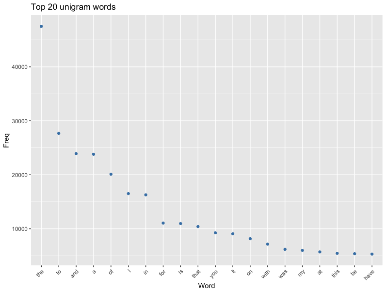
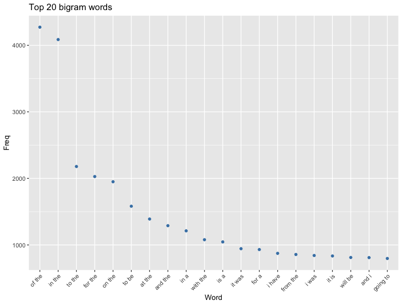
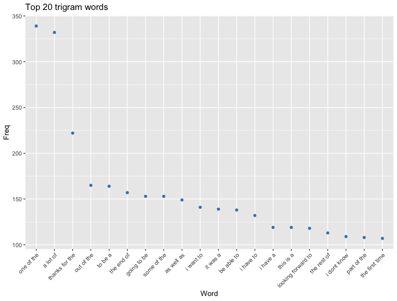
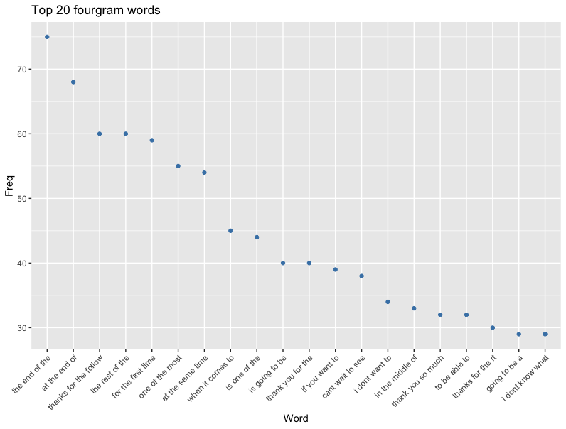
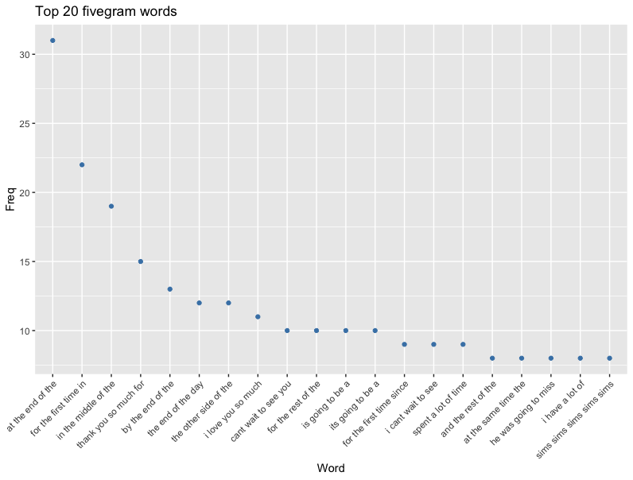

```{r setup, include=FALSE}
library(knitr)
library(png)
opts_chunk$set(fig.width=5, fig.height=3, fig.align='center', message=FALSE, warning = FALSE, echo = TRUE)
```

# Objective

The objective of this capstone project is to bring together the skills learned across the entire 9 segment course. This project is created from ground-up, right from sourcing data, cleaning, formatting and using them to train models and deploy them as a application. 

# Scope
The scope of this report shall be to carry out exploratory analysis and layout the path to a shiny app which would included text prediction models. We shall start with 

* Sourcing and loading of the data
* Parse, poke and play around with the data to get a feel and report summary statistics
* Carry out exploratory analysis and report interesting bits
* Layout plans for creating a prediction algorithm and wrapping it in a Shiny App

In the dataset, there are files in four languages - English, Finnish, German and Russian. We shall be using only English data in this exercise.

# Source and load the data
For this report, the source of the data is from coursera which in turn has been provided by the course partner *SwiftKey*. As stated in the course material, this data was collected from publicly available material using a web crawler. Four language sets have been provided - English, German, Finnish and Russian.
```{r Source data, eval=TRUE}
dataset_url <- "https://d396qusza40orc.cloudfront.net/dsscapstone/dataset/Coursera-SwiftKey.zip"
proj_path <- "/Users/harsha/Projects/DataScience_Coursera/DS_CapStone/"

# Check if the data folder exists, else create it
setwd(proj_path)
if(!file.exists("data")) {
  dir.create("data")
}

# Download the data zip file and upzip it into data folder
if(!file.exists("Coursera-SwiftKey.zip")){
  download.file(dataset_url, "Coursera-SwiftKey.zip")
  unzip(zipfile = "./Coursera-SwiftKey.zip", exdir = "./data")
}
datapath <- "/Users/harsha/Projects/DataScience_Coursera/DS_CapStone/data/final"

# List the contents of dataset
list.dirs(datapath)

```
Now that data has been downloaded, lets us load the data into work space.We see that there are four language sets. Now let us load the English language dataset into workspace.
```{r Load data, eval=TRUE}
en_dataset <- file.path(datapath, "en_US")
# List the files in English dataset
list.files(en_dataset)

# Read the files with files handler objects
con = file(file.path(en_dataset, "en_US.blogs.txt"))
blogdata <- readLines(con, encoding = "UTF-8-MAC", skipNul = TRUE)
close(con)

con = file(file.path(en_dataset, "en_US.news.txt"))
newsdata <- readLines(con, encoding = "UTF-8-MAC", skipNul = TRUE)
close(con)

con = file(file.path(en_dataset, "en_US.twitter.txt"))
xdata <- readLines(con, encoding = "UTF-8-MAC", skipNul = TRUE)
close(con)
```

# Data Summary
Understanding of the data is a subjective task. This can be summarized as where do we source the data from, how does it look like and some general information that can gained before embarking on exploration stage.

## Basic stats - file size, word count, line counts etc
Let us start with simple stats such as file sizes, number of words, lines in each of the files.
```{r Basic Stats, eval=TRUE}
# Inline function for computing file size, takes in object and outputs the size in megabytes
file_size <- function(x){
  format(object.size(x), "MB")
}

# Inline function for lines
line_length <- function(x){
  length(x)
}

# Inline function for character count
character_count <- function(x){
  sum(nchar(x))
}

# Maximum length of lines in a given dataset
max_character <- function(x){
  # Apply a recursive function to identify the longest line in a given file
  max(unlist(lapply(x, function(y){
    nchar(y)
  })))
}

basic_stats <- data.frame("File" = c("Blogs", "News", "X(Twitter)"),
                          "File size" = c(file_size(blogdata),
                                          file_size(newsdata),
                                          file_size(xdata)),
                          "Number of ines" = c(line_length(blogdata),
                                                line_length(newsdata),
                                                line_length(xdata)),
                          "Character count" = c(character_count(blogdata),
                                                character_count(newsdata),
                                                character_count(xdata)),
                          "Maximum line length" = c(max_character(blogdata),
                                                    max_character(newsdata),
                                                    max_character(xdata))
                          )
basic_stats
```
An interesting observation can be made here about the data from twitter files. The `140 character` limit means that all of the data is older than 2017 as twitter doubled its tweet length in 2017!

## Data Sub-sampling
In the course material there is a suggestion that instead of using the entire data, it should be sampled to reduce the size. In the previous section we see that each of the files is at least `~250 MB`, which is kinda difficult to handle. Let us now sub-sample the data and merge them.

```{r Sampling, eval=TRUE}
# Lets take 1% of the data and merge them
sample_size <- 0.01
combined.data.sample <- c(sample(blogdata, length(blogdata) * sample_size), 
                          sample(newsdata, length(newsdata) * sample_size), 
                          sample(xdata, length(xdata) * sample_size))
                          
# Lets look at the stats for sub sampled data
cds_stats <- data.frame("File" = "Combined Data Sample",
                        "File size" = file_size(combined.data.sample),
                        "Number of ines" = line_length(combined.data.sample),
                        "Character count" = character_count(combined.data.sample),
                        "Maximum line length" = max_character(combined.data.sample))
cds_stats
```
The `1%` sub sampled data is comparatively smaller than original three files and we shall continue to use this for the rest of the analyses in this report.

```{r memory clean, eval=TRUE}
# Size of the current working environment
print(object.size(x=lapply(ls(), get)), units = "Mb")

# Let us clean up the working environment by deleting the large file variables
rm(blogdata)
rm(newsdata)
rm(xdata)

# Size of the current working environment after deleting large objects
print(object.size(x=lapply(ls(), get)), units = "Mb")
```
There is factor `100` reduction in memory usage when we used sub-sampled data, which should not be surprise since we explicitly used `1%` sampling!

## Cleaning of data
Let us begin with cleaning of data. There is no clear requirement at this stage and let us explore some basic operations such as removing numbers, punctuation and whitespaces. 
```{r Data Cleaning, eval=FALSE}
library(magrittr)
library(tidyverse)
cleanData <- combined.data.sample %>% 
  unlist() %>% 
  concatenate() %>%
  preprocess(case = "lower", remove.punct = TRUE, remove.numbers = TRUE)
```

# Exploratory Data Analysis

In this section we shall explore the data in terms of word/sentence construction, frequency, use of spaces and so on.

## Tokenization
The cleaned data now has mostly words with few exceptions such as numbers and special characters. At this stage it is sufficient to continue our exploration. To get an understanding of word construction is the dataset, we need to explicitly identify words. This is done by tokenization. This is a process of converting text into a character vector, otherwise known as words or sequence of words. The `tokenize()` function below uses the `ngram_asweka` function from the `ngram` library to separate the text units. Other option would have been to use the `NGramTokenizer()` function from the `RWeka` or the `ngrams` function from `NLP`library. On the Mac OS, it is kinda of hard to get JVM, Weka and the JDK to play together hence we use the `ngram` library.
```{r Tokenization, eval=FALSE}
library(ngram)
#The function tokenize would take the input data and make n-gram data where n range from 1 to 5
tokenize <- function(inputdat, n=1){
    outdat<-inputdat %>%
    ngram_asweka( min = n, max=n, sep = " ") %>%
        table() %>% data.frame()
    outdat[,1]<-outdat[,1] %>% as.character()
    outdat<-arrange(outdat, desc(Freq))
    colnames(outdat)<-c("Word", "Freq")
    outdat
}
```

## Identifying N-Grams
We can continue exploration o by visualizing the frequency and constructs. The unigram is equivalent to word count, and bigram can be visualized as a dictionary set of two word sequences and so on for trigram, fourgram and fivegram.
```{r N-Grams, eval=FALSE}
#Unigrams
unigram <- tokenize(cleanData, 1)
#Bigrams
bigram<-tokenize(cleanData, 2)
#Trigrams
trigram<-tokenize(cleanData, 3)
#Fourgrams
fourgram<-tokenize(cleanData, 4)
#Fivegrams
fivegram<-tokenize(cleanData, 5)

# Get the top 20 instances in each bucket
top1gram<-unigram[1:20,]
top2gram<-bigram[1:20,]
top3gram<-trigram[1:20,]
top4gram<-fourgram[1:20,]
top5gram<-fivegram[1:20,]

# Compute plot elements and store them in variables
p1<-ggplot(top1gram, aes(x=reorder(Word,-Freq), y=Freq))+
  geom_point(col="steelblue")+
  theme(axis.text.x = element_text(angle = 45, hjust = 1))+
    ggtitle("Top 20 unigram words")+
    xlab("Word")

p2<-ggplot(top2gram, aes(x=reorder(Word,-Freq), y=Freq))+
  geom_point(col="steelblue")+
  theme(axis.text.x = element_text(angle = 45, hjust = 1))+
    ggtitle("Top 20 bigram words")+
    xlab("Word")

p3<-ggplot(top3gram, aes(x=reorder(Word,-Freq), y=Freq))+
  geom_point(col="steelblue")+
  theme(axis.text.x = element_text(angle = 45, hjust = 1))+
    ggtitle("Top 20 trigram words")+
    xlab("Word")

p4<-ggplot(top4gram, aes(x=reorder(Word,-Freq), y=Freq))+
  geom_point(col="steelblue")+
  theme(axis.text.x = element_text(angle = 45, hjust = 1))+
    ggtitle("Top 20 fourgram words")+
    xlab("Word")

p5<-ggplot(top5gram, aes(x=reorder(Word,-Freq), y=Freq))+
  geom_point(col="steelblue")+
  theme(axis.text.x = element_text(angle = 45, hjust = 1))+
    ggtitle("Top 20 fivegram words")+
    xlab("Word")
```

## Plots and inferences
In all the plots, only the top 20 sequences in terms of frequency of appearance in the sample data set are shown.

```{r unigram, eval=TRUE}

```
As mentioned before the unigram is basically a word count. The definite article `the` has the highest occurrence in this sample set. Most of the other words tend to be smaller words which indicate that sentence construction in English language is predominantly composed of smaller words.

```{r bigram, eval=TRUE}

```
In the two sequences as well, one can observe that definite article has a strong presence. This is followed by prepositions which can be understood as binding agents in a sentence between noun, pronouns or the noun phrases.

```{r trigram, eval=TRUE}

```
The trigram sequences start to get interesting, where partial sentences and few complete sentences can be identified. The words with shorter length still dominate the distribution, but one can observe words with more than 4 letters appearing consistently.

```{r fourgram, eval=TRUE}

```
In the four word sequences, partial sentences and more importantly meaningfull phrases can be discerned very distinctly.

```{r fivegram, eval=TRUE}

```
The five word sequences don't significantly vary from fourgrams. The interesting aspect to note is that longer words are less as compared to trigrams. This further supports the claim that sentences in English language are predominantly composed of smaller words.

# Outlook
The inference gained from exploratory analysis helps in identifying next steps. 

* A simple text prediction model with an user interface for accepting partial sentences/phrases and displaying predictions for last words shall be developed.
* Using the N-gram model, the last word of a sequence can be predicted given previous `N-1` words.
* The resources used in generating the N-grams and training the model should be considered while designing the algorithm.
* The key aspect would be computing the conditional probability of a word appearing given set of words. This shall be computed using the various N-gram models.

